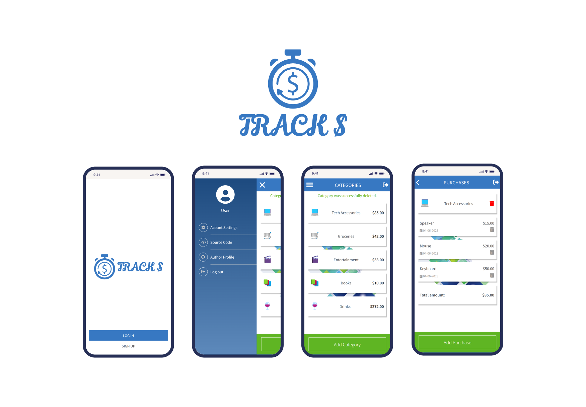

<!-- TABLE OF CONTENTS -->

# 📗 Table of Contents

- [📖 About the Project](#about-project)
  - [🛠 Built With](#built-with)
    - [Tech Stack](#tech-stack)
    - [Key Features](#key-features)
    - [🚀 Live Demo](#live-demo)
- [💻 Getting Started](#getting-started)
  - [Setup](#setup)
  - [Prerequisites](#prerequisites)
  - [Install](#install)
  - [Usage](#usage)
- [👥 Authors](#authors)
- [🔭 Future Features](#future-features)
- [🤝 Contributing](#contributing)
- [⭐️ Show your support](#support)
- [📝 License](#license)

# 📖 Track Budget <a name="about-project"></a>

<div align="center">
  
  <br/>
  
  <br/>
  
  <br/>
  
  <br/>

  <h3><b>Track Budget</b></h3>

</div>

> Track Budget is a mobile web application where you can manage your budget: you have a list of purchases associated with a category, so that you can see how much money you spent and on what category.

## Built With <a name="built-with"></a>

- Ruby
- Rails
- Postgresql

### Tech Stack <a name="tech-stack"></a>

<details>
<summary>Server</summary>
  <ul>
    <li><a href="https://www.ruby-lang.org/en/">Ruby</a></li>
  </ul>
</details>

<!-- Features -->

### Key Features <a name="key-features"></a>

- **[A login page]**
- **[A registration page]**

<p align="right">(<a href="#readme-top">back to top</a>)</p>

<!-- LIVE DEMO -->

## 🚀 Live Demo <a name="live-demo"></a>

- [Live Demo Link](https://track-budget121-70a570d4e3e1.herokuapp.com/)

<p align="right">(<a href="#readme-top">back to top</a>)</p>

## 💻 Getting Started <a name="getting-started"></a>

To run this project, take a copy of the code and follow the instruction below.

### Prerequisites

You need Ruby v3+, Rails v7+ and Postgresql installed on your machine.

### Setup

`Clone the project`

Install gems with:

```
bundle install
```

Setup database with:

```
rails db:create
rails db:migrate
```

### Usage

Start server with:

```
rails server
```

Visit http://localhost:3000/ in your browser.

### Run tests

Install npm with:

Install rspec with:

```
bundle install
```

and

```
rails generate rspec:install
```

run the test with:

```
rspec spec
```

### Open API documentation

```
rails server
```

Visit http://localhost:3000/api-docs in your browser.

### Usage

- Run `rails server` to run the app.

<!-- AUTHORS -->

## 👥 Authors <a name="authors"></a>

👤 **Kaung Myat Kyaw**

- GitHub: [GitHub](https://github.com/Rhaegar121)
- Twitter: [Twitter](https://twitter.com/Rhaegar121)
- LinkedIn: [LinkedIn](https://www.linkedin.com/in/kaungmyatkyaw/)

<p align="right">(<a href="#readme-top">back to top</a>)</p>

<!-- FUTURE FEATURES -->

## 🔭 Future Features <a name="future-features"></a>
- [ ] **[Side Menu]**
- [ ] **[Detail Page]**
- [ ] **[Payment Page]**

<p align="right">(<a href="#readme-top">back to top</a>)</p>

<!-- CONTRIBUTING -->

## 🤝 Contributing <a name="contributing"></a>

Contributions, issues, and feature requests are welcome!

Feel free to check the [issues page](../../issues/).

## Show your support <a name="support"></a>

Give a ⭐️ if you like this project!

<!-- ACKNOWLEDGEMENTS -->

## 🙏 Acknowledgments <a name="acknowledgements"></a>

This replica was originally designed by <a href="https://www.behance.net/gallery/19759151/Snapscan-iOs-design-and-branding?tracking_source=">Gregoire Vella in Behance</a>. Checkout Gregoire Vella's design <a href="https://www.behance.net/gregoirevella">here</a>

<p align="right">(<a href="#readme-top">back to top</a>)</p>

<!-- LICENSE -->

## 📝 License <a name="license"></a>

This project is [MIT](./MIT.md) licensed.

<p align="right">(<a href="#readme-top">back to top</a>)</p>